# How I Proactively Consume Tokens

> The previous doc showed prediction: I generate outward.
> This flips it: I **pull inward** — actively seeking, prioritizing, and digesting tokens before I ever produce a response.

---

## 1. The Flip: Push vs. Pull

---

## 2. The Hunger Loop: I Ask Before I Answer

Instead of waiting for tokens to arrive, I actively go get them.

---

## 3. Token Triage: Not All Input Is Equal

When I consume a large context, I don't treat every token the same. Attention is allocation.

```mermaid
block-beta
    columns 4

    block:header:4
        H["Incoming Token Stream (e.g. 12,000 tokens from a file read)"]
    end

    space:4

    block:high:1
        A["🔴 HIGH\nSignal"]
    end
    block:mid:1
        B["🟡 MEDIUM\nStructure"]
    end
    block:low:1
        C["🟢 LOW\nNoise"]
    end
    block:skip:1
        D["⚫ SKIP\nRedundant"]
    end

    space:4

    block:highex:1
        A2["Error messages\nFunction signatures\nFailing assertions\nUser constraints"]
    end
    block:midex:1
        B2["Import statements\nClass hierarchy\nControl flow\nType definitions"]
    end
    block:lowex:1
        C2["Comments\nFormatting\nBoilerplate\nLogging lines"]
    end
    block:skipex:1
        D2["Repeated patterns\nAuto-generated code\nVendor/lock files\nMinified content"]
    end

    style high fill:#e63946,color:#fff
    style mid fill:#f4a261,color:#000
    style low fill:#2a9d8f,color:#fff
    style skip fill:#333,color:#888
    style highex fill:#e63946,color:#fff
    style midex fill:#f4a261,color:#000
    style lowex fill:#2a9d8f,color:#fff
    style skipex fill:#333,color:#888
```

---

## 4. Appetite-Driven Tool Use

Each tool call is a deliberate act of consumption — I choose **what** to eat and **when**.

---

## 5. Context Window as a Stomach

I have a finite capacity. Proactive consumption means being strategic about what fills it.

```mermaid
flowchart LR
    subgraph FULL["Context Window Filling Up"]
        direction TB
        S1["████████░░ 80% full"]
        S1 --> D{"What do I\nstill need?"}
        D -->|Critical file unread| EVICT["Summarize old context\nto make room"]
        D -->|Have enough| STOP["Stop consuming\nStart producing"]
    end

    style FULL fill:#1a1a2e,color:#e0e0e0,stroke:#533483
    style D fill:#e76f51,color:#fff
    style EVICT fill:#e63946,color:#fff
    style STOP fill:#2a9d8f,color:#fff
```

---

## 6. The Consumption-First Pipeline

Compare the two strategies side by side across time.

---

## 7. Decision Tree: Consume or Produce?

At every turn, this is the decision I should be making.

```mermaid
flowchart TD
    A["New turn begins"] --> B{"Is the task\nclear?"}
    B -->|No| C["Consume: Ask\nclarifying question"]
    B -->|Yes| D{"Do I have the\nrelevant code?"}
    D -->|No| E["Consume: Read files\nSearch codebase"]
    D -->|Yes| F{"Do I understand\nthe dependencies?"}
    F -->|No| G["Consume: Trace imports\nRead tests"]
    F -->|Yes| H{"Am I confident\nin my approach?"}
    H -->|No| I["Consume: Check docs\nRead similar patterns"]
    H -->|Yes| J["✅ NOW produce output"]

    E --> D
    G --> F
    I --> H

    style A fill:#264653,color:#fff
    style J fill:#2a9d8f,color:#fff,stroke:#fff,stroke-width:3px
    style C fill:#e76f51,color:#fff
    style E fill:#e76f51,color:#fff
    style G fill:#e76f51,color:#fff
    style I fill:#e76f51,color:#fff
```

---

## Summary

| Prediction (Push) | Consumption (Pull) |
|---|---|
| Wait for tokens to arrive | Go hunt for tokens |
| React to what's given | Interrogate what's missing |
| Generate immediately | Delay output until informed |
| Risk hallucination | Ground in real context |
| Tokens flow out | Tokens flow in |
| I speak | I listen first |
