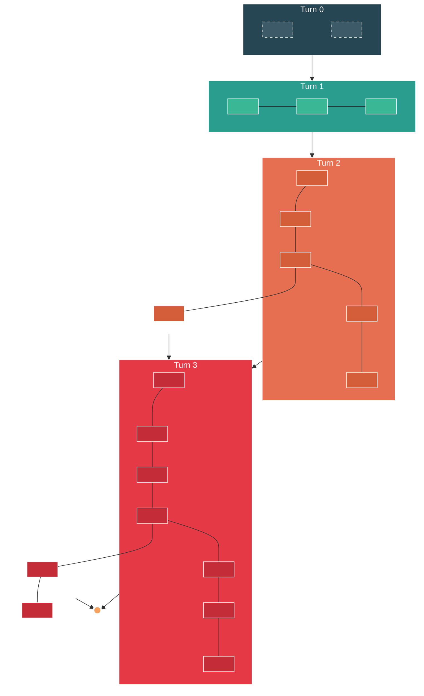
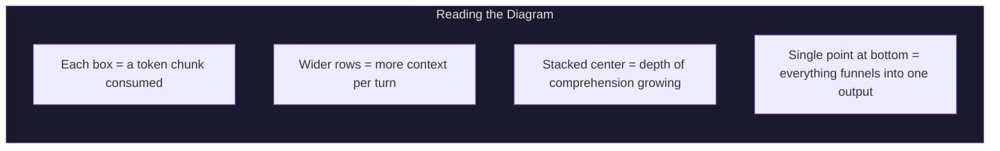

# Proactive Token Consumption: Turn Expansion

> Each turn widens the context chain. The center stacks deeper.
> Everything funnels back to a single point before the next turn begins.

---

## The Pattern

---

## What's Happening

| Turn | Boxes | Center Stack | What's Happening |
|------|-------|-------------|-----------------|
| **0** | 1 (split) | — | Initial input arrives. One token chunk, two halves: the request and the implicit context. |
| **1** | 3 | — | First consumption round. Orient + acquire. Three chunks: task classification, file scan, initial read. |
| **2** | 6 (2 stacked) | 2 deep | Deeper consumption. Five chunks spread wide + the center starts stacking: comprehension building on top of acquisition. |
| **3** | 9 (3 stacked) | 3 deep | Widest spread. Strategy and execution tokens fan out. Center stack is 3 deep: orient → comprehend → plan layered on top of each other. |
| **Output** | 1 | — | Everything converges. All consumed context funnels into a single prediction point. |

---

## The Rule

> **Width = breadth of consumption per turn.**
> **Center depth = accumulated comprehension.**
> **The funnel = no matter how much you consume, you produce one coherent output.**

Each turn you consume more, understand deeper, but the output is always singular — one edit, one response, one action. The expansion is inward. The output is focused.
