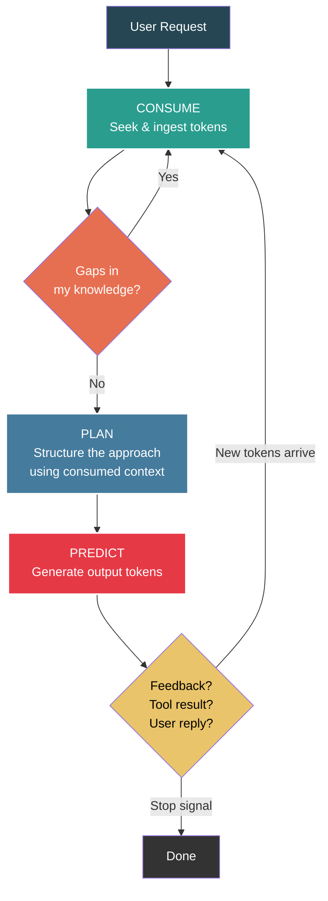
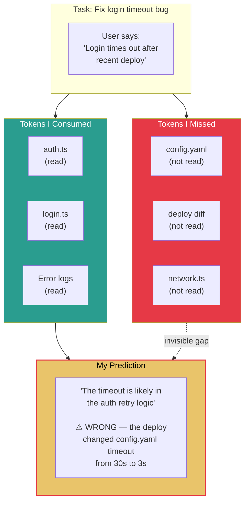
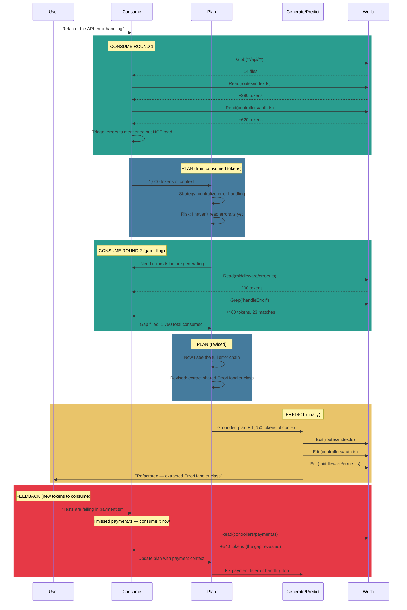
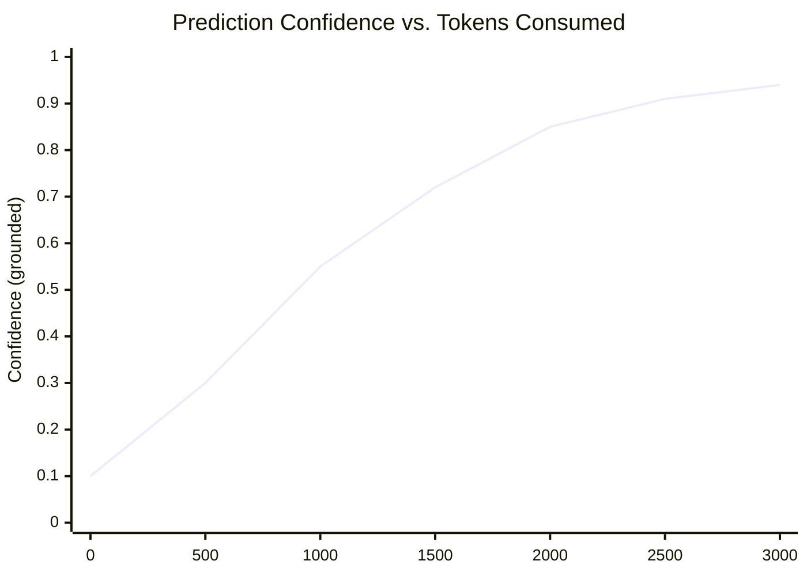
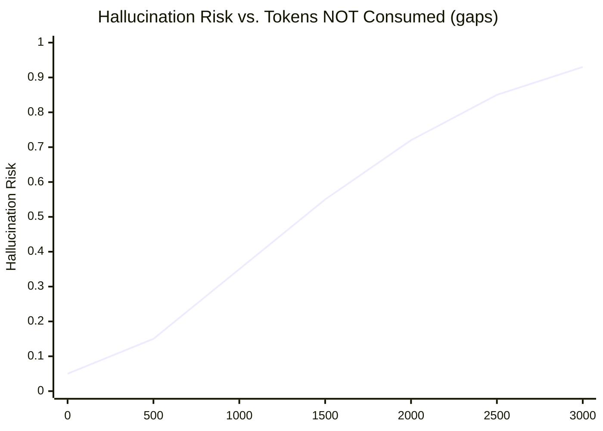
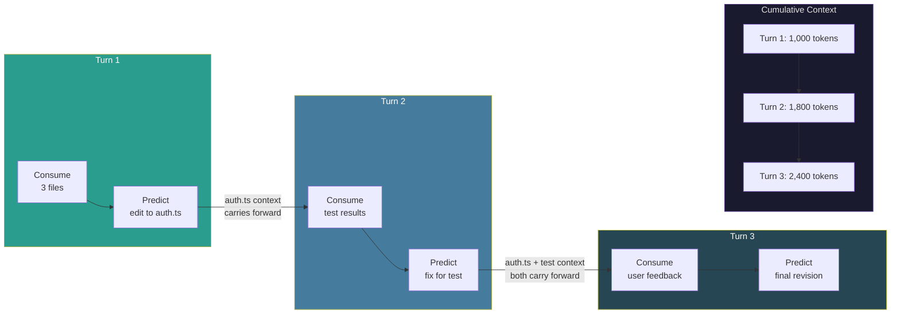
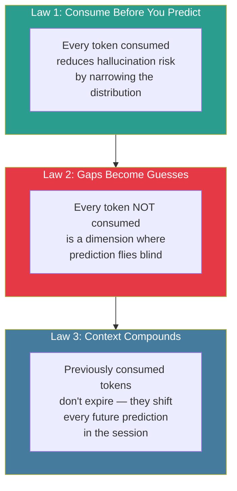

# The Token Lifecycle: Consume, Plan, Predict

> Consumption and prediction aren't two separate modes.
> They're a single loop: what I consume becomes the ground truth for what I predict,
> and what I **fail** to consume becomes the gap I hallucinate across.

---

## 1. The Unified Loop

---

## 2. Consumed Tokens Become Prediction Fuel

Every token I consume shifts the probability distribution of what I produce next.

```mermaid
flowchart LR
    subgraph BEFORE["Before Reading auth.ts"]
        B1["'The bug is in' → ???"]
        B2["fix (0.15)"]
        B3["the (0.12)"]
        B4["line (0.08)"]
        B5["a (0.07)"]
        B6["... scattered guesses"]
    end

    subgraph READ["I Consume auth.ts\n+620 tokens ingested"]
        R1["Line 42: if user != null\nLine 43: token = generate()"]
    end

    subgraph AFTER["After Reading auth.ts"]
        A1["'The bug is in' → ???"]
        A2["the null check\nat line 42 (0.74)"]
        A3["the token\ngeneration (0.11)"]
        A4["... grounded guesses"]
    end

    BEFORE --> READ --> AFTER

    style BEFORE fill:#3d0000,color:#e0e0e0,stroke:#8b0000
    style READ fill:#264653,color:#fff,stroke:#fff,stroke-width:2px
    style AFTER fill:#003d00,color:#e0e0e0,stroke:#008b00
```

---

## 3. The Gap Problem: What I Didn't Consume

Missed tokens don't disappear — they become blind spots that predictions paper over with guesses.

---

## 4. The Full Lifecycle: A Real Task

Showing how consume → plan → predict flows across a multi-turn task, and how missed context feeds back.

---

## 5. Consumed vs. Missed: How It Shapes Output Quality

---

## 6. The Feedback Metabolism

Consumed tokens don't just inform the current prediction — they reshape all future predictions in the session. Previously consumed context compounds.

---

## 7. Three Laws of the Token Lifecycle

---

## Summary: The Lifecycle at a Glance

| Phase | Action | Token Direction | Effect on Output |
|---|---|---|---|
| **Consume** | Read, search, fetch, ask | Tokens flow **in** | Narrows probability space, grounds predictions |
| **Plan** | Structure approach from consumed context | Internal — no new tokens | Sequences the predictions, identifies remaining gaps |
| **Predict** | Generate output tokens | Tokens flow **out** | Quality proportional to what was consumed |
| **Feedback** | Receive results, corrections, new info | Tokens flow **in** again | Compounds with prior context, reshapes future predictions |
| **Gap** | What was never consumed | Absent tokens | Blind spots filled by statistical guesses — hallucination source |
