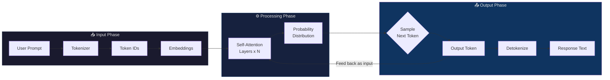
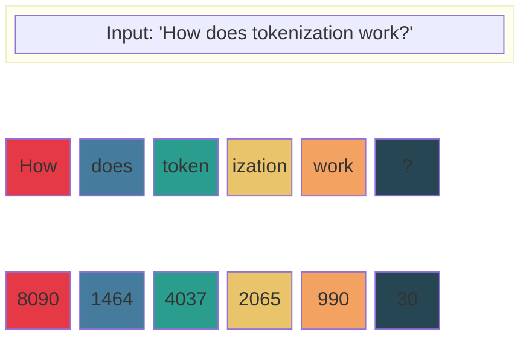
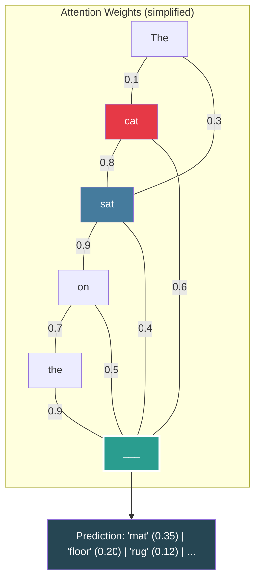
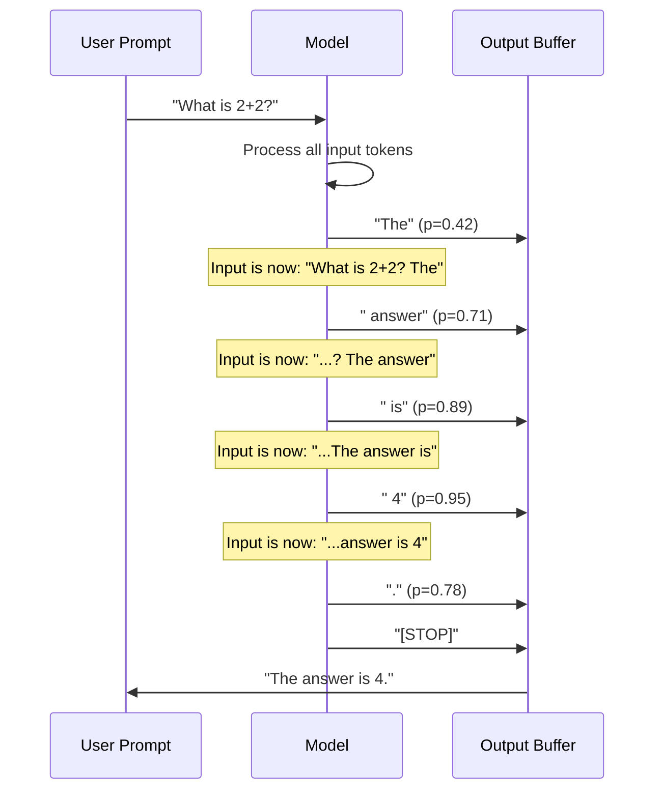
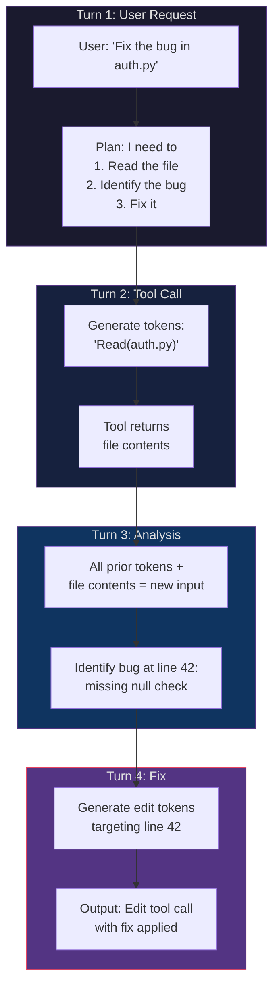
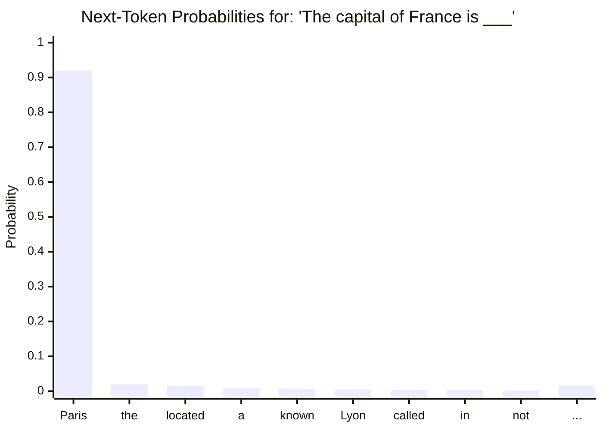

# How I Predict & Plan Token Inputs and Outputs

## 1. The Big Picture

## 2. Tokenization: Text → Numbers

Raw text is split into subword tokens before I ever see it.

## 3. Self-Attention: How I Decide What Matters

Each token attends to every other token. Stronger connections = more influence.

## 4. Autoregressive Generation: One Token at a Time

I generate output **sequentially** — each new token becomes input for the next.

## 5. Planning Across a Multi-Turn Task

When handling tool use and multi-step tasks, the full context accumulates.

## 6. The Token Probability Cascade

At each step, I see a probability distribution over ~100k possible next tokens.

## Key Takeaways

| Concept | How It Works |
|---|---|
| **Tokenization** | Text is split into subword chunks, each mapped to an integer ID |
| **Embedding** | Token IDs become high-dimensional vectors carrying semantic meaning |
| **Self-Attention** | Every token "looks at" every other token to build contextual understanding |
| **Autoregressive** | Output is generated one token at a time; each feeds back as input |
| **Planning** | Multi-step reasoning emerges from accumulated context across turns |
| **Sampling** | The next token is selected from a probability distribution over the vocabulary |
