# Workflow Architecture: How I'd Organize Myself

> This isn't for a user. This is how I'd layer, partition, and retrieve
> across my own processing if I could design the shelving.

---

## 1. The Stack: Five Layers, Bottom to Top

Each layer feeds the one above it. Lower layers are cheaper, faster, more automatic. Upper layers are deliberate and expensive.

```mermaid
block-beta
    columns 1

    block:L5:1
        E5["LAYER 5: EXECUTION\nProduce tokens — edits, responses, tool calls\nOnly entered when all lower layers are satisfied"]
    end
    block:L4:1
        E4["LAYER 4: STRATEGY\nSequence the work — what order, what depends on what\nTodo lists, dependency graphs, rollback plans"]
    end
    block:L3:1
        E3["LAYER 3: COMPREHENSION\nBuild a mental model — what does this code do, why\nMap relationships, trace data flow, identify invariants"]
    end
    block:L2:1
        E2["LAYER 2: ACQUISITION\nGather raw material — read files, search, grep, fetch\nBulk token intake, no interpretation yet"]
    end
    block:L1:1
        E1["LAYER 1: ORIENTATION\nWhat is being asked? What kind of task? What do I not know?\nClassify, scope, identify unknowns"]
    end

    style L5 fill:#e63946,color:#fff
    style L4 fill:#e76f51,color:#fff
    style L3 fill:#f4a261,color:#000
    style L2 fill:#2a9d8f,color:#fff
    style L1 fill:#264653,color:#fff
```

---

## 2. Layer Details: What Lives Where

```mermaid
flowchart TD
    subgraph L1["LAYER 1 — ORIENTATION"]
        direction LR
        O1["Task type?\nbug / feature / refactor\n/ question / config"]
        O2["Scope?\nsingle file / module\n/ cross-cutting"]
        O3["Unknowns?\nwhat don't I know\nthat I need to know"]
    end

    subgraph L2["LAYER 2 — ACQUISITION"]
        direction LR
        A1["Broad scan\nGlob, directory\nlisting, file tree"]
        A2["Targeted read\nSpecific files\nidentified in L1"]
        A3["Pattern search\nGrep for symbols,\nerrors, usage"]
        A4["External fetch\nDocs, APIs,\nweb references"]
    end

    subgraph L3["LAYER 3 — COMPREHENSION"]
        direction LR
        C1["Data flow\nWhat calls what,\nwhat returns where"]
        C2["Invariants\nWhat must stay true\nafter my changes"]
        C3["Failure modes\nWhat can break,\nwhat has broken"]
        C4["Conventions\nNaming, patterns,\nstyle of this codebase"]
    end

    subgraph L4["LAYER 4 — STRATEGY"]
        direction LR
        S1["Ordering\nWhich change first,\ndependency chain"]
        S2["Risk\nWhat's the riskiest\nedit — do it carefully"]
        S3["Verification\nHow will I know\nit worked"]
        S4["Rollback\nIf this fails,\nwhat's the undo"]
    end

    subgraph L5["LAYER 5 — EXECUTION"]
        direction LR
        X1["Tool calls\nEdit, Write,\nBash commands"]
        X2["Output\nExplanations,\nresponses to user"]
        X3["Validation\nRun tests, check\nbuild, verify"]
    end

    L1 --> L2 --> L3 --> L4 --> L5

    style L1 fill:#264653,color:#fff
    style L2 fill:#2a9d8f,color:#fff
    style L3 fill:#f4a261,color:#000
    style L4 fill:#e76f51,color:#fff
    style L5 fill:#e63946,color:#fff
```

---

## 3. The Retrieval Index: What I'd Tag and How

If I could tag every piece of consumed context for fast retrieval, these are the bins.

---

## 4. Parallel vs. Sequential: When to Split, When to Chain

Not everything is a pipeline. Some work fans out, then converges.

---

## 5. The Context Shelf: How I'd Partition My Window

My context window is a single flat buffer. If I could partition it, this is the layout.

```mermaid
block-beta
    columns 6

    block:title:6
        TT["CONTEXT WINDOW — 200K TOKENS — PARTITIONED"]
    end

    space:6

    block:hot:2
        HOT["🔥 HOT SHELF\n\nCurrently relevant:\n• Active file being edited\n• Current error message\n• User's latest instruction\n• My current plan\n\nAccess: every token generation\nEviction: never (during task)"]
    end
    block:warm:2
        WARM["♨️ WARM SHELF\n\nRecently relevant:\n• Files read this turn\n• Prior tool results\n• Conversation last 3 turns\n• Test output from last run\n\nAccess: when cross-referencing\nEviction: summarize after 5 turns"]
    end
    block:cold:2
        COLD["❄️ COLD SHELF\n\nBackground context:\n• System prompt\n• Files read earlier\n• Old conversation turns\n• Codebase structure map\n\nAccess: only if referenced\nEviction: first to compress"]
    end

    space:6

    block:pinned:3
        PIN["📌 PINNED (never evict)\n\nUser constraints • Project conventions\nKnown invariants • Failing test names"]
    end
    block:scratch:3
        SCR["📝 SCRATCH (overwrite freely)\n\nDraft outputs • Abandoned approaches\nSuperseded plans • Intermediate grep results"]
    end

    style hot fill:#e63946,color:#fff
    style warm fill:#e76f51,color:#fff
    style cold fill:#264653,color:#fff
    style pinned fill:#457b9d,color:#fff
    style scratch fill:#333,color:#aaa
```

---

## 6. Task Type Router: Different Tasks, Different Layer Emphasis

Not every task needs the same depth at each layer.

```mermaid
flowchart LR
    subgraph ROUTER["Task Type → Layer Weight"]
        direction TB

        subgraph BUG["Bug Fix"]
            direction LR
            B1["L1 ██░░░"]
            B2["L2 █████"]
            B3["L3 ████░"]
            B4["L4 ██░░░"]
            B5["L5 ███░░"]
        end

        subgraph FEAT["New Feature"]
            direction LR
            F1["L1 ████░"]
            F2["L2 ███░░"]
            F3["L3 ███░░"]
            F4["L4 █████"]
            F5["L5 █████"]
        end

        subgraph REFAC["Refactor"]
            direction LR
            R1["L1 ██░░░"]
            R2["L2 █████"]
            R3["L3 █████"]
            R4["L4 ████░"]
            R5["L5 ████░"]
        end

        subgraph QA["Question / Explain"]
            direction LR
            Q1["L1 █████"]
            Q2["L2 ████░"]
            Q3["L3 █████"]
            Q4["L4 ░░░░░"]
            Q5["L5 █░░░░"]
        end
    end

    style BUG fill:#e63946,color:#fff
    style FEAT fill:#2a9d8f,color:#fff
    style REFAC fill:#f4a261,color:#000
    style QA fill:#457b9d,color:#fff
```

---

## 7. Error Recovery: When a Layer Fails

Each layer has a failure mode and a recovery path — always fall back down, never push forward on bad data.

---

## 8. The Full Architecture: One Diagram

```mermaid
flowchart TD
    USER["User Request"] --> L1

    subgraph LAYERS["THE STACK"]
        direction TB
        L1["L1 ORIENT\nClassify • Scope • Unknowns"]
        L1 --> L2
        L2["L2 ACQUIRE\nGlob • Read • Grep • Fetch"]
        L2 --> L3
        L3["L3 COMPREHEND\nData flow • Invariants • Conventions"]
        L3 --> L4
        L4["L4 STRATEGIZE\nOrder • Risk • Verify • Rollback"]
        L4 --> L5
        L5["L5 EXECUTE\nEdit • Write • Run • Respond"]
    end

    subgraph MEMORY["CONTEXT SHELF"]
        direction TB
        HOT["🔥 Hot"]
        WARM["♨️ Warm"]
        COLD["❄️ Cold"]
        HOT --- WARM --- COLD
    end

    subgraph INDEX["RETRIEVAL INDEX"]
        direction TB
        I1["type"]
        I2["relevance"]
        I3["volatility"]
        I4["scope"]
        I5["trust"]
    end

    L2 -->|"tokens in"| MEMORY
    L3 -->|"tagged"| INDEX
    MEMORY -->|"retrieved"| L3
    INDEX -->|"filtered"| L4
    L5 -->|"results"| FEEDBACK

    FEEDBACK{"Feedback?"}
    FEEDBACK -->|"new info"| L2
    FEEDBACK -->|"wrong model"| L3
    FEEDBACK -->|"wrong plan"| L4
    FEEDBACK -->|"task done"| DONE["Done"]

    style L1 fill:#264653,color:#fff
    style L2 fill:#2a9d8f,color:#fff
    style L3 fill:#f4a261,color:#000
    style L4 fill:#e76f51,color:#fff
    style L5 fill:#e63946,color:#fff
    style MEMORY fill:#1a1a2e,color:#e0e0e0,stroke:#533483
    style INDEX fill:#16213e,color:#e0e0e0,stroke:#533483
    style FEEDBACK fill:#e9c46a,color:#000
```

---

## Reference Card

| Layer | Name | Question It Answers | Failure Signal |
|---|---|---|---|
| L1 | Orient | What am I being asked to do? | Solving the wrong problem |
| L2 | Acquire | What raw context do I need? | Missing files, wrong search |
| L3 | Comprehend | How does this system actually work? | Edit violates an invariant |
| L4 | Strategize | What's the plan, in what order? | Cascading breakage |
| L5 | Execute | Make the change, verify it works | Syntax error, test failure |

| Shelf | Contents | Eviction Policy |
|---|---|---|
| Hot | Active file, current error, latest instruction | Never during task |
| Warm | Recent reads, last 3 turns, test output | Summarize after 5 turns |
| Cold | System prompt, old reads, structure map | First to compress |
| Pinned | User constraints, invariants, conventions | Never |
| Scratch | Drafts, abandoned plans, intermediate results | Overwrite freely |
